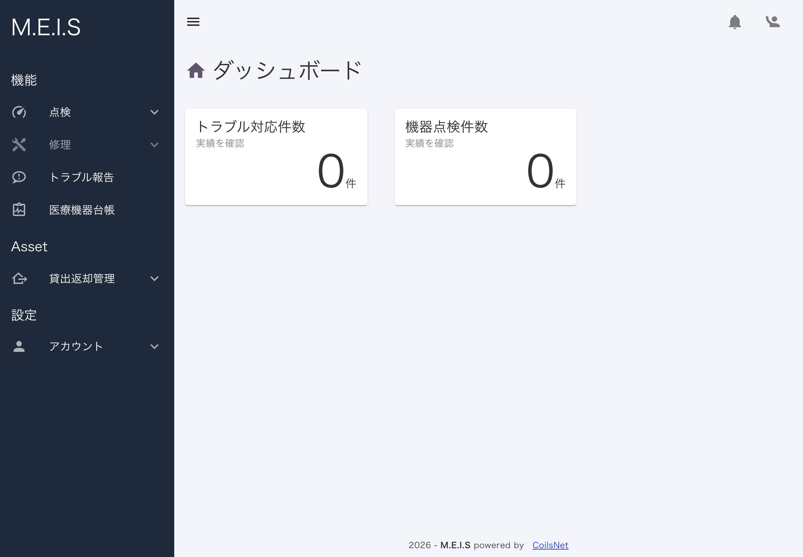
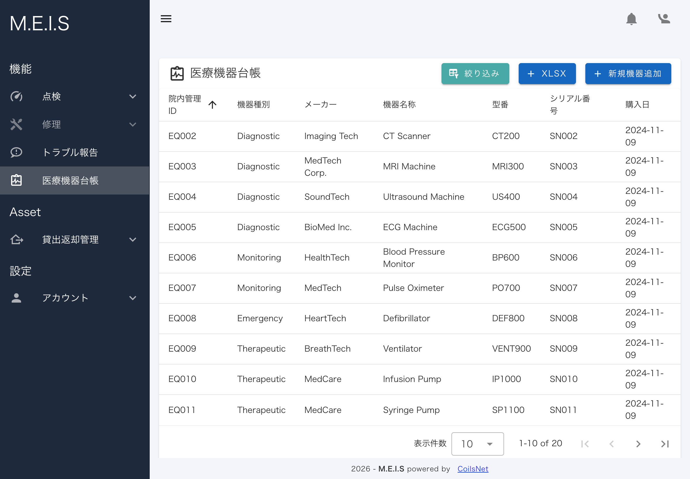
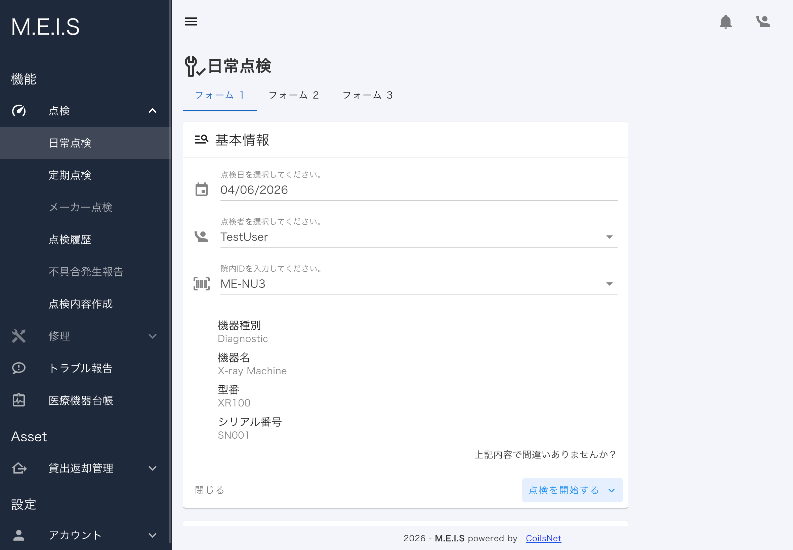
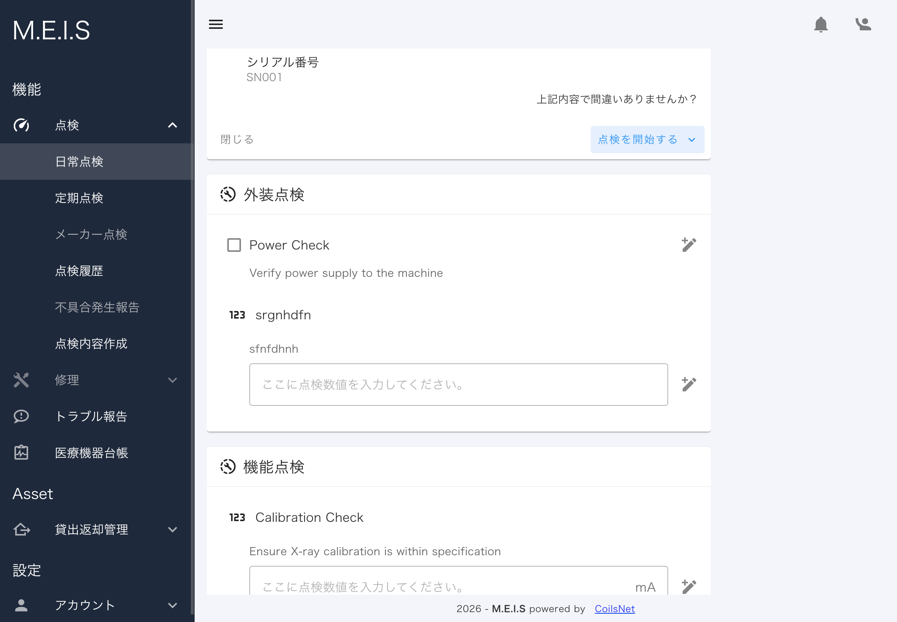
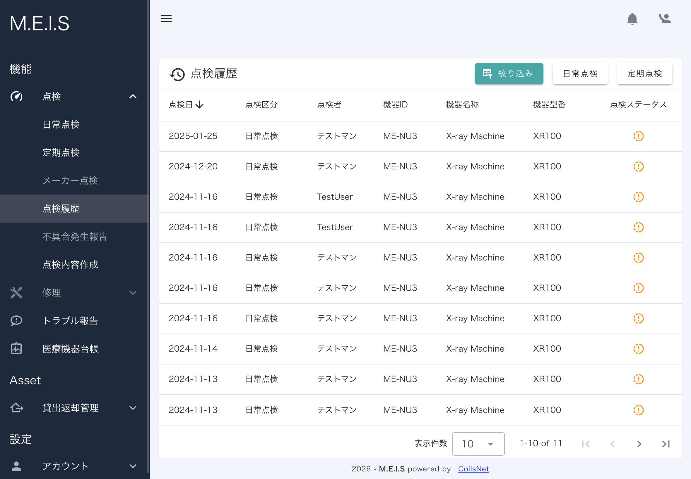
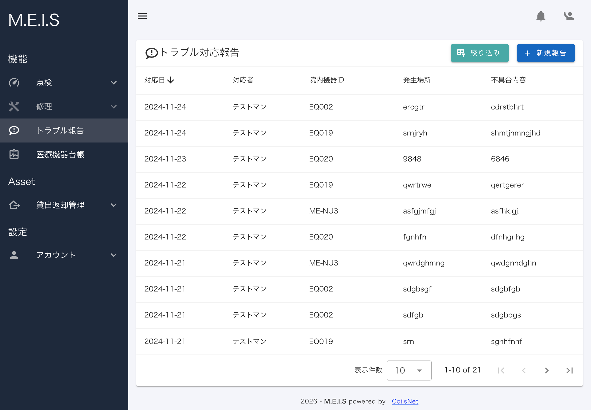

# M.E.I.S - Medical Equipment Inspection System

**クラウド型医療機器点検記録管理Webアプリ**

> プロダクト公式サイト：[https://meis-info.coils-net.net/](https://meis-info.coils-net.net/)

---

## 概要

医療現場の「紙による点検記録運用」を終わらせるために開発した、クラウド型の医療機器点検記録管理システムです。

企画・設計・実装・本番デプロイまでを個人で担当し、**現在も実業務で稼働中**です。

>※本リポジトリはリファクタリング済みのコードを公開しています。
>デモ環境はリファクタリング前のバージョンで稼働しているため、一部動作や構成が異なります。
>また諸般の理由から一部機能を除いた構成での公開となっています。

---

## デモ環境

テスト用アカウントで全機能を試せます。

**URL：** [https://meis-dev.onrender.com/](https://meis-dev.onrender.com/)

| 項目      | 値            |
| ------- | ------------ |
| メールアドレス | test@test.jp |
| パスワード   | test123      |

> ⚠️ デモ環境はRenderの無料プランで稼働しています。初回アクセス時はサーバーの起動に30〜60秒かかる場合があります。
> ⚠️ デモデータは定期的にリセットされます。

---

## 開発背景・課題

現職（臨床工学技士）での医療機器管理業務において、以下の課題を長年感じていました。

- **台帳はExcel、点検記録は紙**という分断された管理体制
- 点検のたびにペンを持ってファイルに記録する手間
- 過去の履歴を確認するには、積み重なったファイルを一枚一枚めくる必要がある
- 「この機器、以前にも同じトラブルがあったか？」を現場で即座に判断できない

既製品の導入も検討しましたが、導入コストが当院の規模に対して過大であったため、**必要な機能に絞った自作**という判断をしました。　

### 製品コンセプト
- いつでも・どこからでも。場所も環境もデバイスも選ばない
- 本当に必要な情報に最短距離でアクセス
- 事務作業を減らし、医療技術の提供にフルコミット

---

## 主な機能

| 機能           | 概要                    |
| ------------ | --------------------- |
| 医療機器台帳管理     | 機器情報の登録・編集・検索         |
| 点検記録入力       | スマートフォン・タブレット対応のUIで入力 |
| 点検履歴確認       | 機器ごとの履歴を即時参照          |
| 貸出・返却機能      | 機器の中央管理のための貸出返却       |
| マルチウィンドウ点検登録 | 複数機器の点検を並行して登録        |
| トラブル報告管理     | トラブル内容の記録・履歴管理        |
| バーコード読み取り    | QRコード・バーコードで機器を即時特定   |
| 台帳XLSXインポート  | 既存のExcel台帳からのデータ移行に対応 |
| 招待制ユーザー登録    | メール招待による安全なユーザー追加     |
| 権限管理         | 管理者／一般の2段階ロール         |

> **注記：** 貸出・返却管理機能はこのリポジトリには含まれていません。一身上の判断により非公開としています。

### ユースケースメインのUI設計
#### 操作性ファースト
日々使う機能は、なるべく少ない操作でアクセスできるよう意識して設計しました。

また、手袋着用での操作や片手での操作を想定し、基準より少し大きめかつ余白のあるデザインを意識しました。
#### 実務へのノイズを減らす
並列で複数の点検を行う実情をふまえ、点検入力も並列で行えるようなUI×UXを意識して作成しました。

また、数値測定のある点検結果入力項目は、基準値を超過するとアラートが出るようにすることで視覚的にも認知しやすく意識しています。

### 手入力を減らす工夫
入力間違いを極力減らせるよう、意識して設計しました。

その一つが「機器ID」のバーコード入力です。
デバイスのカメラで機器のバーコードを撮るだけで、「機器ID」の入力が可能です。
（あらかじめ該当コードの登録とバーコードシールの用意が必要です。）

### 既存運用からの移行コストを下げる設計

XLSXファイルインポート機能を実装し、既存のExcel台帳からデータを引き継ぎやすいようにしました。

既存のXLSXから引き継ぎ用のXLSXにコピーする手間はありますが、一つずつ入力する必要はありません。

「使い始めのハードルを下げること」を設計方針の一つに置いています。

---

## 技術スタック

### フロントエンド

| 技術           | 採用理由                                                                                              |
| ------------ | ------------------------------------------------------------------------------------------------- |
| Nuxt3 / Vue3 | 通信環境が不安定な医療現場での利用を想定し、SPAライクなUXを実現するためにNuxt3を採用。 フロント・API処理を単一構成で管理し、個人開発でも構成をシンプルに保つため採用。     |
| Vuetify 3    | デザインを一から実装することに開発リソースを割くより、本質的な機能実装に集中すべきと判断。 メジャーなコンポーネントライブラリの中からドキュメントの充実度を基準にVuetify 3を採用。 |
| TypeScript   | 型定義による実装ミスの防止と保守性の確保                                                                              |

### バックエンド・認証

| 技術                  | 採用理由                                                                                                                                       |
| ------------------- | ------------------------------------------------------------------------------------------------------------------------------------------ |
| Nuxt3 Server API    | バックエンドを別フレームワークで構築することも検討したが、異なる言語・設計を並行して学習しながら開発を進めることは現実的でないと判断。 Nuxt3のServer APIを採用し、フロント・バックを同一プロジェクトで完結させることで開発速度と学習コストのバランスを取った。 |
| JWT (jsonwebtoken)  | ステートレスな認証設計。Cookie（HttpOnly / Secure）で管理しXSSリスクを低減                                                                                         |
| @sidebase/nuxt-auth | Nuxt3向けの認証基盤として採用                                                                                                                          |
| bcrypt              | パスワードのハッシュ化。平文保存なし                                                                                                                         |
| nuxt-security       | HTTPヘッダーのセキュリティ強化                                                                                                                          |

### データベース・インフラ

| 技術         | 採用理由                                                                                          |
| ---------- | --------------------------------------------------------------------------------------------- |
| PostgreSQL | 機器と点検履歴の1対多構造にリレーショナルDBが適切と判断。 また複数ユーザーによる同時入力が発生するユースケースを想定し、トランザクション管理が堅牢なPostgreSQLを採用。 |

### ライブラリ

| ライブラリ             | 用途                     |
| ----------------- | ---------------------- |
| SheetJS (xlsx)    | Excel台帳のインポート処理        |
| vue-qrcode-reader | バーコード読み取り              |
| vuedraggable      | 直感操作を実現するために、D&Dでの並び替え |
| nodemailer        | 招待メール送信                |
| date-fns          | 日付処理                   |
| wanakana          | 病院名のローマ字変換など           |

---

## 2026/06リファクタリングについて

初期実装は2023年ころ検索やドキュメントを参考にAI（chatGPT3.5）を併用しながら所謂「バイブコーディング」で構築しました。
動くものは早期に完成しましたが、以下のような問題が残っていました。

- 認証ミドルウェアが存在せず、API直叩きで認証をバイパスできる状態
- 認証情報をリクエストボディから受け取るだけのセキュリティ上の欠陥
- 各APIで`console.log`が散在し、エラーハンドリングも新旧Ver.の推奨構成が混在
- Options APIとComposition APIが混在

これらを認識した上で、ポートフォリオとして公開するにあたりコードの品質を正直に評価し、体系的にリファクタリングを実施しました。

主な対応内容は以下の通りです。

- `server/middleware/auth.ts`によるJWT検証の一元化
- ユーザー情報の取得をサーバー側DB照会に統一
  （リクエストボディからユーザー情報の受け取りを廃止し、機器IDなどの処理に必要なものだけを受け取る方式に変更）
- 全APIエンドポイントのエラーハンドリング統一（`createError`パターン）
- 全ファイルをTypeScriptに移行。型指定も可能な限り指定。
- 複数件DB操作のトランザクション化

「AIで書いたコードをそのまま出す」のではなく、「何が問題でどう直したか」を理解した上で公開することを方針としています。

しかし、現時点では対応しきれていない箇所もあるため、今後も学習と並行してよりよいサービスとして提供できるよう、改善に努めて行きます。

---

## 制約・実運用に向けて

このアプリは個人・小規模施設での利用を想定した学習・実用目的のプロジェクトです。

医療情報システムとして本格運用するには、以下の追加対応が必要と認識しています。

- **監査ログ（Audit Trail）：** 誰がいつ何を変更したかの証跡記録
- **論理削除：** 物理削除ではなく`deleted_at`による削除管理
- **点検記録の不変性：** 訂正は「訂正記録」として追跡する仕組み
- **バックアップ・リストア方針の策定**
- **3省2ガイドライン・薬機法への準拠確認**

---

## スクリーンショット

### ダッシュボード

### 医療機器台帳

### 点検入力（基本情報）

### 点検入力（点検項目）

### 点検履歴

### トラブル対応報告

---

## 運用状況

- **運用開始：** 2024年10月（β版）
- **利用者：** 臨床工学技士 2名
- **管理機器数：** 約100台以上

リリース後も機能追加・改善を継続しており、貸出返却管理機能（2025年2月）など要望ベースでのアップデートを行っています。

---

## 開発者

**Sho Ohtsuka**
臨床工学技士 / Webエンジニア

- 公式サイト：[https://meis-info.coils-net.net/](https://meis-info.coils-net.net/)
- 個人事業：[CoilsNet](https://coils-net.net/)

---

## ライセンス・帰属表示

このプロジェクトは以下のOSSを使用しています。

**SheetJS (xlsx)**
Copyright (C) SheetJS LLC
Licensed under the Apache License, Version 2.0
https://sheetjs.com/
